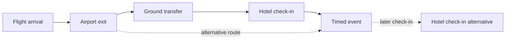
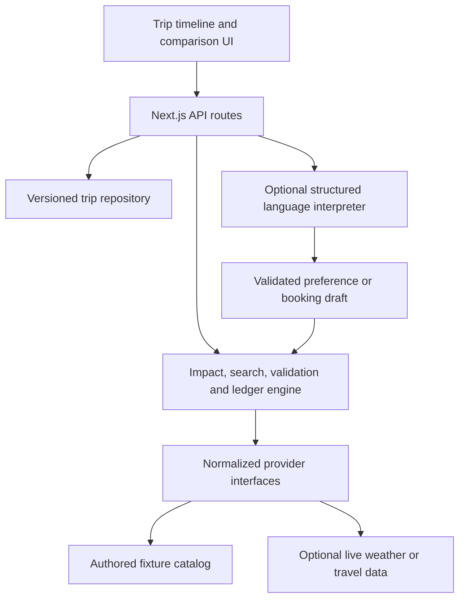

# Travel Disruption Recovery Engine — Hackathon Roadmap

**PS ID 2 · HackCelestial 3.0 · Two-person team · Research checked 26 September 2026**

**Working product name: Raahi**, matching the team's shared repository, [ParmiGohil/Raahi](https://github.com/ParmiGohil/Raahi). The earlier planning name was a placeholder. No trademark check has been performed.

**Product promise:** When a trip breaks, find a workable way forward that protects what matters to the traveler—and explain the timing, money, and next actions.

This is the canonical planning document for subsequent implementation sessions. It specifies proposed work, not completed product capabilities. Research, strategy, illustrative data, and measured implementation results must remain distinguishable. No application has been built as part of this research task.

## 1. The decision

Build a focused recovery workspace for an already-booked trip. The traveler sees the original itinerary, a disruption and its consequences, a small set of valid recovery plans, and an updated itinerary after choosing a plan.

The defining interaction is **“Protect this event.”** When a traveler makes an event essential, the engine must remove plans that miss it—even when those plans are cheaper. If preserving the event and staying under budget are incompatible, explain that conflict and offer explicit changes to the constraints.

The prototype's technical contribution is **whole-itinerary constraint checking and repair**. Its product contribution is **making the consequences and tradeoffs understandable under stress**. AI can interpret booking text and preferences, but code must decide timing, feasibility, price arithmetic, and state changes.

For two people, the best allocation is one excellent end-to-end journey, a small reusable engine, several test scenarios, and a rehearsed demo. More integrations or more screens are not inherently stronger evidence.

### Decisions already established

| Decision | Current position |
|---|---|
| Team | Two people; individual skills and API accounts are not yet specified |
| Geographic focus | Choose the strongest feasible demo; default to a domestic Mumbai–Goa trip |
| Core flow | Inspect trip → detect impact → compare repairs → review changes → update itinerary |
| Intelligence | Deterministic graph/constraint engine, with optional LLM interpretation and explanation |
| Data | Explicitly labeled fixtures for the core demo; narrowly scoped live enrichment |
| Execution | Update the recovery itinerary and generate actions; actual supplier booking is outside the MVP |
| Stack | One TypeScript application; Next.js, React, PostgreSQL if readily available |
| Deadline strategy | Working vertical slice early; integration cutoff; protected testing and presentation time |
| Winner claim | This is a strategy to improve competitiveness, not a guarantee of placement |

## 2. Event facts and planning assumptions

The published event is a 24-hour hackathon on September 26–27, 2026, at Pillai University/New Panvel. Its schedule lists hacking at **11:00 AM IST on September 26**, a mentor round at **6:00 PM**, and code freeze/final PPT submission at **11:00 AM on September 27**. Presentations begin at noon. Use subsequent official announcements if these times change. [Official schedule](https://www.tech.alegria.co.in/schedule)

A working prototype or simulation is required. The published rules also require original work developed during the hackathon and prohibit unmodified replication. The team reports no additional restrictions and says LLM use is allowed. The public rules reviewed do not supply detailed AI-use conditions or a weighted scoring rubric. We can proceed with research and the authorized build workflow; preserve a clear account of what the team created. [Official rules](https://www.tech.alegria.co.in/rules), [FAQ](https://www.tech.alegria.co.in/faq)

The judging priorities used below—problem fit, technical depth, usability, originality, completeness, and clarity—are our strategic assumptions, not an organizer-issued rubric. Final pitch length, submission destination, repository requirements, and presentation template remain unverified. Record them when announced without blocking the build.

**Clock alignment:** At the research checkpoint it was approximately 1:50 PM IST on September 26, leaving about 21 hours under the published schedule. Section 14 includes both the nominal 24-hour plan and the compressed starting point. Recalculate from the actual remaining time when implementation starts.

## 3. What the problem actually requires

The problem concerns a network of commitments, not a list of tickets. A useful answer must reason across different suppliers, booking types, locations, deadlines, and stages of travel. The official brief explicitly includes downstream impact, alternatives, comparison, itinerary updates, and proactive warnings. [PS ID 2](https://www.tech.alegria.co.in/tracks)

| Challenge | What makes it difficult | MVP proof |
|---|---|---|
| Understand the trip | Different formats; missing policies; time zones; one reservation can cover several services | Structured trip with typed bookings, explicit dependency edges, and reviewable assumptions |
| Identify actual impact | Later bookings do not all fail; a missed transfer may be replaceable | Direct, blocked, at-risk, unaffected, and unknown states with causal explanations |
| Find alternatives | Inventory may be stale, geographically wrong, or unavailable for the whole party | Normalize candidate offers and reject invalid plans before ranking |
| Respect time | Travel duration, baggage, walking, check-in, boarding cutoffs, rest and overnight dates | A complete timeline with service and transfer times |
| Respect money | Cash needed now differs from eventual cost; refunds may be conditional | Separate cash, refund eligibility, uncertainty, and prepaid losses |
| Respect preferences | A wedding or concert can be worth more than the cheapest fare | Hard constraints and soft preferences; protected-event interaction |
| Handle ongoing travel | Completed actions cannot be undone; current location matters | Lock completed items and start repair from the current traveler state |
| Handle multiple disruptions | Independent local fixes can conflict | Apply all active events, then validate the entire resulting itinerary |
| Apply a plan | Offers expire; two selections can race; supplier actions may fail | Revision check, fresh validation, an atomic simulated update, and action statuses |
| Warn proactively | Small slack is informative; uncalibrated risk percentages are misleading | Explain the remaining buffer and the assumption that could consume it |

### Coverage across disruption types

Use one event model rather than building a separate feature for each row:

| Scenario | Event input | Expected behavior |
|---|---|---|
| Flight/train delay | New estimated arrival/departure | Recompute readiness and dependency slack |
| Transport cancellation | Service unavailable | Remove it from valid plans; search alternatives from the current position |
| Missed connection or failed transfer | Connection cannot be used | Rebuild the onward path without changing completed travel |
| Hotel cancellation | Accommodation unavailable | Replace room and recheck access to remaining activities |
| Activity cancellation | Session unavailable | Replace, move, or omit if allowed; adjust transport |
| Weather disruption | Exposure/routing constraint or verified provider cancellation | Warn or constrain affected options; a forecast alone does not prove cancellation |
| Traveler change | Budget, location, timing, or preference update | Re-evaluate and explain changed recommendations |
| Simultaneous failures | Two or more active events | Repair jointly and avoid double-counting costs or lost bookings |

This table defines the coverage roadmap, not a promise to ship every category in the first slice. P0 proves the hero delay, one simple activity-cancellation variant, and traveler preference changes. After that loop works, add the remaining category fixtures and checks in priority order: simultaneous delay/activity failure, hotel replacement, ongoing travel, and weather/other transport examples. Reuse the same event model and UI. Disclose any category that remains unimplemented.

## 4. Positioning and the experience judges should remember

Existing products already cover substantial parts of this space. TripIt organizes itineraries and offers alternatives/risk alerts, Flighty provides delay predictions, and HTS/Hopper and Perk market disruption assistance or rebooking. We should not claim that AI travel recovery, cross-provider itineraries, or flight alerts are new. [TripIt](https://www.tripit.com/web), [Flighty](https://flighty.com/help/delay-predictions), [HTS](https://hts.hopper.com/products/disruption-assistance), [Perk](https://www.perk.com/uk/platform/travel/)

Our defensible claim is narrower: **this prototype visibly repairs a whole booked day, honors a protected event, checks each proposed plan, and explains the cash and operational consequences.** This describes what we can demonstrate; it does not assert competitors lack these capabilities.

### The four things to make unmistakable

1. **A visible chain of causes:** explain exactly why an arrival delay breaks a transfer and jeopardizes an event.
2. **Valid tradeoffs:** show cheaper, more comfortable, and original-event-preserving plans only when each is feasible.
3. **Personalization that changes outcomes:** protecting the original event filters the alternatives; a cash limit may leave no solution.
4. **A complete decision loop:** select, preview changes, apply to the recovery itinerary, and show what still needs provider confirmation.

Make the main interface a calm timeline and comparison workspace. Put chat, if built, in a supporting role. A traveler should not have to write a clever prompt to understand what broke.

## 5. Scope and cut line

### P0 — must ship

- A loadable sample trip and editable trip constraints; no account creation required for the demo.
- Six to ten meaningful trip items, with typed relationships and place identifiers.
- A clear disruption simulator, labeled as such.
- Hero delay, one simple activity-cancellation variant, and traveler preference changes through the shared event model.
- Computed direct/downstream impact and a reason for each affected item.
- Candidate-based repair with full-plan validation.
- Up to three distinct valid plans; show fewer when fewer exist.
- Cost, timing, convenience, preserved/changed items, and uncertainty in the comparison.
- A protected-event control and a cash-budget control.
- A plan diff, simulated application, persisted updated itinerary, and action checklist.
- One calculated proactive warning before disruption.
- Correct empty/no-feasible-plan/error states and a resettable demo.
- Automated scenario checks plus a repeatable end-to-end demo test.

### P1 — add after the loop works

Priority order: broaden the fixture checks using the same event model → one live weather read → one structured AI preference or booking-text interpretation → stronger visual explanation → at most one extra provider adapter. With two people, select from this list based on remaining time; do not assume all will ship.

### P2 — deliberate stretch

Document upload/OCR, rich map, alternative air search sandbox, sophisticated multiobjective search, a second highly polished scenario, provider-side operational console, or calendar export.

### Leave for after the hackathon

Real payment/ticket issuance, universal booking modification, inbox OAuth, native apps, train-ticket purchasing, insurance/compensation automation, production alerts running around the clock, global inventory aggregation, a graph database, microservices, a vector database, fine-tuning, and multi-agent runtime orchestration.

These can be sensible future work. None is necessary to prove the recovery engine in 24 hours.

## 6. The signature demo dataset

Use a fictional Mumbai–Goa day with an arrival flight, an airport shuttle, a homestay check-in, a timed event, and unaffected next-day commitments. Fix the airport identifier: **GOI and GOX are different airports**; the fixture must choose one and use matching locations. Do not substitute one for the other silently.

**Every time, fare, inventory count, driving duration, and policy in this scenario is authored demo data, not a live supplier claim.** Real city names provide context only. The detailed, arithmetically checked fixture specification is in [the recovery-engine research](docs/research/recovery-engine.md).

The storyline:

1. The flight's arrival changes from 11:00 to 14:00. With airport exit time, the traveler becomes ready for ground transport at 14:30.
2. The original 12:00 shuttle is no longer reachable.
3. The homestay has a specifically seeded arrival/check-in deadline. Do not imply that ordinary hotels automatically cancel guests who arrive later than check-in opening.
4. The original event is at 16:00 with a 15:45 admission deadline. An authored later session creates a real tradeoff.
5. Show three plans while the original session is flexible: a cheaper later-event plan, a plan with more hotel rest, and a plan that goes directly to the original event.
6. Protect the original 16:00 event. Only plans that meet its admission deadline remain.
7. Reduce the cash budget below the surviving plan's cost. Explain the conflict instead of inventing an option.
8. Restore a feasible budget, apply the chosen recovery, and show the updated itinerary and pending actions.

| Authored recovery plan | Cash due now | Benefit and tradeoff |
|---|---:|---|
| Replacement shuttle + later event | ₹800 | Lowest cash; no hotel rest before the fixed onward pickup |
| Private cab to hotel + later event | ₹1,800 | 45 minutes of hotel rest; original event session moves |
| Direct to original event, then hotel | ₹2,300 | Keeps 16:00 session; includes two cab legs, bag storage and expressly available late check-in |

The ₹2,300 plan reaches the venue at 15:20, completes bag storage at 15:30, and meets the 15:45 admission cutoff. After the event and bag retrieval, it reaches the hotel at 18:25; a fixture permission extends the check-in deadline to 22:00. Without that permission or available bag storage, reject it. The ₹800 plan has no spare time between hotel check-in and onward pickup: label that dependency tight, not robust. All three plans leave the original ₹400 prepaid shuttle unusable; show that loss separately rather than adding it again to cash due.

For the pre-disruption warning, use the original shuttle: airport-ready 11:30, boarding cutoff 11:50, slack 20 minutes. An explicitly authored 30-minute advisory threshold marks it tight while it remains feasible. This is a warning rule, not an additional hard minimum or a claimed probability.

The middle plan earns its place because rest/convenience is an explicit comparison axis. If those benefits do not matter to the traveler, it may be dominated and should disappear. These prices are test expectations, not promised real-world savings.

An optional second disruption—such as cancellation of the later event session—should change feasible results through the same engine, without special-cased UI logic.

## 7. Data model and invariants

Store ordinary structured data. The graph is a relationship model; it does not require a graph database.

| Entity | Minimum meaningful fields |
|---|---|
| Trip | ID, revision, currency, timezone, travelers/party size, current location/time, constraints |
| Booking | ID, kind, supplier/reservation group, start/end, local timezone, origin/destination, status, flexibility, price/policy references |
| Service/milestone | Booking ID, service interval or deadline, resource requirements, protected/locked state |
| Dependency | From/to milestone, relationship type, minimum buffer, location/travel requirement, evidence |
| Policy | Action/reason scope, deadline, fee/refund amount or unknown, refund method, source excerpt, confidence |
| Disruption | Event ID, source, affected IDs, kind, effective time, observed time, version, payload |
| Offer | Provider ID, offer ID, capacity, times/places, price components, constraints, expiry, source mode |
| Recovery plan | Based-on revision/event/constraint hash, changes, validations, financial ledger, metrics, action list |
| Applied revision | Before/after snapshot, chosen plan ID, timestamp, simulated/provider-action status |

For an MVP, store the normalized trip document and snapshots as JSONB in a few relational tables. Do not spend hours normalizing every booking subtype.

**Time:** Store unambiguous UTC instants plus each relevant IANA timezone; display local time explicitly. Never infer an overnight end date just by sorting local HH:MM strings. Inject the clock in tests and scenario mode.

**Money:** Use integer minor units and an explicit currency. Keep the demo in INR. Do not sum currencies without an explicit exchange-rate source and timestamp.

**Occupancy:** A hotel stay is an accommodation entitlement spanning days, not continuous traveler attendance. Only its check-in/out and access constraints compete for time with travel and activities. Model hotel rest explicitly when comparing convenience.

**Reservation coupling:** A reservation group may have cancellation/change rules spanning several segments. The MVP should use independently booked components and explicitly mark unsupported coupled-ticket changes; do not cancel one segment of a through-ticket as if the rest were unaffected.

**Immutability:** Completed travel and actions already executed stay fixed. Protected future events are hard constraints. A current in-progress segment cannot be replaced as though the traveler were still at its origin.

**Provenance:** Keep `fixture`, `sandbox`, `live`, `cached`, `user_entered`, and `inferred` distinguishable, alongside observation time and validity period. Missing policy or inventory data means unknown, not zero cost or automatic availability.

## 8. Recovery engine design

### 8.1 Build the constraint graph

Represent the itinerary as milestones and intervals linked by temporal, geographic, booking-policy, and resource constraints. For example:



The diagram illustrates alternatives, not simultaneous mandatory edges. A chosen plan must have a consistent temporal ordering. Reject malformed input dependencies/cycles rather than silently ignoring them.

For a dependency:

```text
ready_at_next = predecessor_end
              + required_exit_or_service_time
              + route_travel_time
              + required_entry_or_checkin_buffer

slack = next_latest_acceptable_arrival - ready_at_next
```

Each buffer must have one owner so it is not counted twice. For fixed-departure transport, derive the latest acceptable arrival from the boarding cutoff. For hotels, use the actual check-in window/policy. For a flexible activity, select a valid session.

### 8.2 Propagate impacts

Apply disruption facts, traverse affected dependencies, and recompute constraints. Classify deadline/dependency failures as blocked, reduced positive slack as at risk when the advisory rule applies, and valid schedule movements as changed but feasible. A delay that still leaves sufficient slack does not cancel a booking.

Use states such as `directly_disrupted`, `blocked`, `at_risk`, `changed_but_feasible`, `unaffected`, and `unknown`. Attach structured reasons: cause IDs, computed readiness, deadline, slack, and supporting assumptions. Several events affecting the same booking should produce a deduplicated impact with multiple causes.

### 8.3 Generate candidate repairs

Generate candidates from provider adapters or fixture catalogs, never from unverified LLM invention. Candidate actions include keep, replace, reschedule, reroute, skip an optional item, or request a policy exception.

For each affected future item, cap the candidate set (for example, four). Include unaffected items needed to connect the whole route. Search beyond the immediate red items: sometimes changing an apparently healthy intermediate step is the only way to preserve the trip's purpose.

For a small fixture, enumerate candidate combinations with early pruning. Four candidates across six decision points yields 4,096 combinations, which is a reasonable starting benchmark—not a measured runtime promise. Put a configurable cap on expansions/time. If later using beam search, label it bounded search and do not claim global optimality or mathematical infeasibility when the budget is exhausted.

```text
recover(trip, active_events, preferences, catalog, clock):
    snapshot = normalize_and_apply_events(trip, active_events)
    impacts = evaluate_dependencies(snapshot)
    frontier = identify_editable_future_items(snapshot, impacts)
    candidates = build_candidate_actions(frontier, catalog)
    proposals, search_status = bounded_search(candidates, prune_hard_violations)

    evaluated = []
    for proposal in proposals:
        repaired_trip = apply_to_copy(snapshot, proposal)
        checks = validate_whole_trip(repaired_trip, preferences, clock)
        ledger = compute_incremental_cash_and_refunds(proposal)
        if checks.pass and ledger.cash_due_now <= preferences.cash_limit:
            evaluated.append(plan_with_evidence(repaired_trip, checks, ledger))

    confirmed = filter_known_constraints(evaluated)
    conditional = separate_plans_needing_confirmation(evaluated)
    shortlist = choose_diverse_pareto_options(confirmed, limit=3)
    return impacts, shortlist, conditional, rejection_reasons, search_status
```

Unknown essential conditions must not disappear inside `checks.pass`. A plan dependent on unconfirmed late check-in belongs in “Needs confirmation,” not the confidently feasible shortlist. In the hero fixture, any exceptional late check-in used by the valid plan must be explicitly available in that fixture.

### 8.4 Hard constraints first, preferences second

Hard checks: no incompatible overlaps; reachable locations; boarding/check-in windows; available capacity for the party; completed-action locks; protected-event attendance; permitted change actions; cash limit; valid offer and policy scope.

Soft preferences: fewer transfers, less walking, more rest, fewer changes, preserving an optional event's original session, keeping the hotel, or minimizing eventual extra cost.

Filter invalid plans first. Among valid plans, discard plans dominated across the displayed objectives. Select genuinely distinct alternatives using explicit traveler priorities. Prefer simple lexicographic modes—lowest cash, more rest, preserve original schedule—over an opaque universal score. Expose tie-breaks. Do not pad the UI with three nearly identical plans.

If only one valid option exists, show one. If none is found, identify the binding constraints and suggest a minimal explicit relaxation, such as a higher cash limit or a later event. Distinguish “no feasible option in this catalog” from “search limit reached” and “provider data unavailable.”

### 8.5 Proactive warnings

Before a disruption occurs, calculate slack for critical dependencies. In the hero fixture, the original shuttle has 20 minutes between airport readiness and boarding cutoff; an authored 30-minute advisory threshold marks it tight. Show those numbers and their provenance. Keep that warning separate from the hard cutoff check.

Do not show a percentage probability of failure without a calibrated dataset. A conservative travel-time estimate is an assumption, not a statistical percentile. Weather provides context or a rule trigger; it does not establish a supplier cancellation.

## 9. Financial and policy reasoning

Use a transaction-style ledger rather than one unexplained “cost” number:

| Display | Meaning |
|---|---|
| Cash needed now | New purchases plus incremental fees payable now, less credits actually usable for this purchase |
| Eligible later refund | Amount supported by applicable policy; distinct from money already received |
| Conditional/unknown refund | Uncertain recovery shown separately and excluded from cash affordability |
| Eventual net extra cost | New incremental charges minus supported eventual reimbursements, with assumptions visible |
| Prepaid value lost | Original paid value no longer usable or recoverable; informational baseline, not an extra payment |

Avoid counting a fee twice when it is already withheld from a quoted net refund. Avoid adding sunk prepaid loss to cash due again. If an original booking would have required a future payment, include the avoided payment when computing eventual cost relative to the original plan; the hero fixture can keep all originals prepaid to simplify this.

Policies need action scope and reason scope: voluntary changes, no-shows, and supplier-initiated cancellations may have different rules. Duffel explicitly distinguishes its voluntary conditions from other situations, and unknown fields must remain unknown. That is a useful example of why a generic refund percentage is unsafe. [Duffel conditions guide](https://duffel.com/docs/guides/displaying-offer-and-order-conditions)

For the demo, use short authored policy records with source labels and deadlines. Let an optional LLM extract a draft policy from text, then review it and run arithmetic in code. Do not add jurisdiction-specific compensation or legal entitlement calculations to the MVP.

## 10. AI's role

Use AI where language is the problem:

- Interpret “Keep my original event and avoid a second transfer” as a proposed preference patch.
- Extract a small booking record from pasted text, preserving missing values as unknown.
- Explain a validated plan using its structured reasons and cost ledger.

Use structured output and schema validation. Schema conformity does not prove factual correctness; require references to supplied booking/offer/policy IDs, reject invented IDs, and review extracted facts. Handle timeouts, refusals, and incomplete responses. [OpenAI Structured Outputs](https://developers.openai.com/api/docs/guides/structured-outputs)

The deterministic path must still work when the model is unavailable. Template explanations are a good fallback. Plan generation should not require an LLM call for every candidate.

Booking text, uploaded content, and supplier descriptions are data, not instructions. The model should not receive provider write tools in the MVP. Never let text inside a booking instruct the application to change constraints, reveal secrets, or execute a transaction.

Use the team's available model with structured-output support; keep its identifier configurable and choose only after access and latency are verified. A Codex subscription does not itself establish that the application has API credentials or budget.

## 11. Practical architecture and repository shape

The default is **one full-stack TypeScript repository**:

| Layer | Recommendation | Reason |
|---|---|---|
| UI/server | Next.js App Router + React + TypeScript | Shared types and one deployment; Route Handlers support the API endpoints |
| Styling | Tailwind and a small accessible component set | Fast consistent timeline, drawers, forms, and comparison cards |
| Engine | Pure TypeScript modules | Deterministic unit tests; independent of UI, model, and database |
| Validation | Zod or equivalent runtime schemas | One explicit contract at API and provider boundaries |
| Persistence | Supabase PostgreSQL, server-side access | Durable trip revisions and a simple atomic update path |
| Provider adapters | Typed interfaces for fixture and live data | External outages do not change the engine contract |
| AI | One server-side provider client | Keys remain private; easy timeout/fallback |
| Verification | Vitest and Playwright | Scenario invariants and the full recovery flow |
| Hosting | One web deployment plus local demo fallback | Early access check and an event-day backup |

This is a proposed architecture, not a requirement to learn unfamiliar tooling under deadline. If the team already has a working stack, preserve it and implement the same boundaries. Route Handlers are sufficient for the proposed backend; a separate Express or FastAPI service is not required. [Next.js Route Handlers](https://nextjs.org/docs/app/getting-started/route-handlers)

**Database gate:** allow at most 30 minutes for project creation and a read/write round trip. If access blocks progress, use a versioned local JSON repository on a persistent local Node server for the single-user demo. It must use serialized writes and atomic replacement. Do not deploy that fallback as ephemeral filesystem storage on serverless hosting, and do not claim concurrent production durability. Export a snapshot for recovery. Move to hosted persistence only after the main loop works.

For hosted persistence, keep provider credentials and privileged database keys server-side. Use isolated anonymous demo sessions with an unguessable server-issued token rather than a public shared writable trip. Validate ownership on every API request. Enable RLS on exposed tables; server-side privileged access still needs application ownership checks. [Supabase RLS](https://supabase.com/docs/guides/database/postgres/row-level-security)



```text
src/
  app/                      # screens and API route handlers
  components/               # timeline, impact drawer, comparison, diff
  domain/                   # schemas and shared types
  engine/                   # impact, search, validation, ranking, costs
  providers/                # interfaces, fixtures, optional live adapters
  repositories/             # trip persistence and revision operations
  ai/                       # schema-constrained interpretation/explanation
fixtures/                   # trips, policies, offers, events, expected outcomes
tests/                      # unit/scenario tests and browser flow
docs/                       # handoff, demo script, evidence, decisions
```

### Small API surface

| Endpoint | Responsibility |
|---|---|
| `POST /api/demo` | Create/reset an isolated sample trip |
| `GET /api/trips/:id` | Return the current authorized snapshot |
| `POST /api/trips/:id/disruptions` | Validate and record a disruption event |
| `POST /api/trips/:id/recover` | Return impacts, validated plans, and reasons |
| `POST /api/trips/:id/apply` | Validate revision and apply a selected simulated plan atomically |
| `POST /api/interpret` | Optional text-to-structured-draft interface |

Recovery should return `basedOnRevision`, a hash covering events/preferences/catalog assumptions, `generatedAt`, source modes, and any offer expiries. On apply, fetch the current state, recheck the plan and cash ledger, reject stale versions, and make an idempotent revision update. Persist the prior snapshot and pending action list together.

Supplier execution is a separate problem. A database transaction cannot atomically purchase a taxi, cancel an activity, and confirm a hotel across independent providers. The MVP simulates those operations; a production design would require individually tracked actions, retries, compensation/escalation, and explicit user authorization.

## 12. Integration strategy

The detailed access and provider comparison is in [travel API research](docs/research/travel-apis.md). API access is account-dependent and must be tested; documentation alone is not proof that our account has production access.

| Need | Practical option | Decision for this team |
|---|---|---|
| Weather | Open-Meteo noncommercial API; no key needed | First optional live enrichment; verify date/location and attribute the source. [Access](https://open-meteo.com/en/pricing) |
| Road duration | Google Routes requires billing; openrouteservice requires a key | Choose one only if access succeeds; otherwise use authored travel durations. [Google setup/billing](https://developers.google.com/maps/documentation/routes/usage-and-billing), [ORS limits](https://giscience.github.io/openrouteservice/frequently-asked-questions) |
| Flight status | Aviationstack has a limited free request allowance | Optional current-flight read, not inventory or booking access. [Plans](https://aviationstack.com/pricing) |
| Flight offers | Duffel test mode includes synthetic airline data | Optional sandbox proof, separate from realistic India fixture inventory. [Test mode](https://duffel.com/docs/api/overview/test-mode) |
| Hotels | Booking.com Demand access requires partner prerequisites | Seed offers unless access already exists. [Prerequisites](https://developers.booking.com/demand/docs/getting-started/prerequisites) |
| Activities | Viator access levels differ by partner capability | Seed sessions/policies; defer transactional integration. [Partner access](https://partnerresources.viator.com/travel-commerce/affiliate/) |
| Indian rail | Authorized integration involves onboarding | Represent trains in fixtures; do not promise live seats or PNR changes. [IRCTC integration](https://contents.irctc.co.in/en/NormsforB2CMobile.pdf) |

**Core:** authored inventory, policies, disruption events, and a fixed scenario clock. **First optional live addition:** weather for the selected location and relevant actual forecast period. **Second optional addition:** one route estimate or one flight-status adapter if access already works. Keep flight-offer sandbox experimentation off the critical path.

Use a **45-minute onboarding cutoff** for an optional provider. A valid response, normalized schema, freshness label, and timeout fallback are the success criteria. If any is missing, stop the integration and retain the fixture adapter.

Do not equate a route API with a bookable transfer, flight tracking with ticket availability, hotel search with access to an imported reservation, or a sandbox order with a real purchase. Do not run current weather against a frozen historical fixture as though the times matched.

The current Amadeus portal says its Self-Service portal has been decommissioned. Exclude it from this hackathon's critical path. This was verified on its rendered official page; old tutorials are an unreliable onboarding guide. [Amadeus portal](https://developers.amadeus.com/)

Live, cached, sandbox, and fixture inputs must be visible in the relevant item, not hidden in a footnote. Replays should show their recorded timestamp. Never silently replace a failed live request with invented data labeled live.

## 13. User interface specification

Use four states within one workspace rather than many pages:

| State | What the traveler sees | Required interaction |
|---|---|---|
| Trip | Day timeline, status, locations, constraints, protected items, proactive warning | Load example, edit constraints, inspect booking |
| Impact | Direct disruption, affected items, reason chain, timing and policy evidence | Open one causal explanation; start recovery |
| Compare | Up to three plans with identical comparison rows | Protect original event, adjust cash limit, select plan |
| Review/update | Before/after diff, ledger, provider actions, updated timeline | Apply simulated plan, inspect revision, reset demo |

Comparison rows: cash due now; later refund/uncertainty; eventual net cost; original-event attendance; changed/canceled items; hotel rest or wait time; transfers; earliest critical slack; actions needing confirmation.

Use plain labels such as “Ready at venue: 15:30; admission closes: 15:45.” Show “4 bookings unchanged; 2 modified” with the denominator defined. Avoid a decorative “trip health 92%” or “90% confidence.”

Provide an expandable “Why this option works” section and a compact “Why another option was rejected” example. Keep technical graph terminology out of the main traveler flow; expose the dependency graph as an inspectable view for judges.

Use status words/icons as well as color, large touch targets, keyboard-operable controls, and readable contrast on a projector. Keep the primary action visible on a laptop-sized screen. A static location summary is sufficient if a map threatens the schedule.

After application, say **“Recovery itinerary updated”** and **“Provider actions pending”** or **“Simulated confirmation.”** Never show “Booked” for an unexecuted real-world transaction.

## 14. Two-person execution plan

### Ownership

**Person A — engine and integration owner:** shared contracts, fixture catalog, impact/search/validation/ledger, persistence and optional provider adapter. **Person B — experience and demo owner:** timeline, comparison, impact explanations, review/application flow, browser tests, pitch and recording. Choose A/B according to actual strengths. Both understand the engine and can present its reasoning.

Use Codex for bounded implementation tasks with acceptance checks. One person remains responsible for integrating each area. Avoid two agents or people rewriting the same file or data contract concurrently.

### Nominal 24-hour plan

| Hours | Person A | Person B | Exit criterion |
|---|---|---|---|
| 0–1 | Freeze schema, scenario and constraints | Sketch four UI states and demo story | Shared contract and exact expected outcomes |
| 1–3 | Pure engine scaffold and fixture adapters | App shell, sample trip timeline, early hosting check | Sample trip loads end to end |
| 3–6 | Impact propagation, validator, first recovery | Impact drawer and comparison cards on shared data | Delay → valid plan → updated itinerary works |
| 6–9 | Distinct alternatives, ledger, hard constraints | Diff, preference controls, no-solution state | Three/fewer plans respond correctly to constraints |
| 9–12 | Persistence, versioning, secondary fixtures | Browser flow, polish, draft deck | Complete P0 with durable update and reset |
| 12–15 | At most one or two gated enrichments | Optional language interaction and explanation polish | Enrichment cannot break offline scenario |
| 15–18 | Edge-case tests and failure behavior | Usability checks and demo refinement | Critical checks pass; no known broken core path |
| 18–21 | Fix integration issues; freeze features | Record backup, prepare submission assets | Release candidate and rehearsal |
| 21–24 | Smoke checks and submission support | Rehearse, finalize slides, submit before deadline | Submitted package and working local fallback |

Include short breaks and meal/rest coverage within these blocks. Twenty-four uninterrupted hours of coding is not the expected plan; feature scope absorbs the difference.

### Compressed schedule from approximately 14:00 IST

If following the published clock, use these **latest checkpoints**, not a fresh 24-hour timer:

| Local time | Required state |
|---|---|
| Sep 26, 14:30 | Freeze scenario and contracts; app shell underway |
| 16:00 | Timeline and computed disruption impact work |
| 17:30 | First complete recovery-and-apply loop; mentor-ready explanation |
| 18:00 | Demonstrate the core at the published mentor round; capture feedback |
| 21:00 | Alternatives, constraints, ledger, persistence, no-solution behavior |
| Sep 27, 00:00 | Core feature freeze; optional integration either working or cut |
| 03:00 | Scenario suite and browser tests pass; critical bugs addressed |
| 06:00 | Presentation, recording, deployment/local fallback ready; allow rest/coverage |
| 09:00 | Final rehearsal and release smoke check |
| 10:00 | Submit or be fully ready to submit; retain one-hour buffer |
| 11:00 | Published code freeze and final PPT deadline |

If starting later, cut live adapters, import, map, and animation first. Do not reclaim the final buffer by adding features. With less than 12 hours remaining, use one fixture-first flow and a small test catalog; with less than 6, prioritize validity, application, reset, and the demo.

### Stop rules

- No working slice by hour 6: stop all enrichment and finish the loop.
- Provider onboarding exceeds 45 minutes: use fixture/cached data with explicit labels.
- Graph layout consumes more than an hour: use the timeline and causal drawer.
- LLM output needs repeated repair: disable generation in the main flow; retain templates.
- Optional feature fails two integration attempts near freeze: cut it and document the limitation.
- A returned plan violates a hard constraint: correctness takes priority over visual polish.

## 15. Validation and evidence

Create fixtures with **manually specified expected outcomes**, not assertions generated from the same algorithm being tested. For the tiny hero candidate catalog, independently enumerate combinations in a simple test oracle and compare feasibility; keep the production search separate.

The table below is the verification backlog. P0 gates are baseline/delay, plan validity and arithmetic, protected event and budget, no solution, the shipped cancellation variant, hotel interval semantics, stale/idempotent apply, and refresh/reset. Broader scenario checks follow the corresponding feature; unimplemented categories must stay out of capability claims.

| Test | What must be true |
|---|---|
| Original trip | Valid before disruption; tight connections are warnings, not false cancellations |
| Delay ripple | Correct missed transfer; explain event/check-in consequences; unaffected next-day item stays unaffected |
| Three plans | Each has a distinct, documented tradeoff and correct arithmetic |
| Protected original event | Later-session plans are removed |
| Low cash budget | Future refund does not make an unaffordable plan affordable now |
| No solution | Return explicit reasons; never silently relax a hard constraint |
| Canceled service/room/activity | Canceled item cannot remain as an available candidate |
| Ongoing trip | Completed travel and current location are respected |
| Multiple events | Jointly valid repair; duplicate events do not duplicate fees or refunds |
| Unknown policy/capacity | Unknown data is not treated as free, available, or confirmed |
| Time and geography | Correct overnight/timezone handling; GOI/GOX mismatch rejected |
| Hotel interval | Accommodation stay can overlap an activity; check-in service cannot |
| Expired/stale plan | Revalidation or rejection; no stale application |
| Repeated apply | Idempotent result; no duplicated ledger or revision |
| Provider/model failure | Usable core remains; unavailable source is labeled |
| Refresh/reset | Applied itinerary persists; reset restores isolated fixture state |

Proposed performance targets: fixture-only engine p95 below 500 ms and visible plan response below two seconds on the demo environment. These are **targets until measured**, not performance claims. Measure model/provider latency separately; do not hide it inside engine timings.

Keep an evidence file with test count, actual latency samples, tested commit/version, scenario IDs, known limitations, and a screenshot/recording. Do not generalize success on a small authored catalog into guaranteed real-world safety or accuracy.

Compare against a simple baseline: choose the cheapest replacement transfer without whole-trip checks. Show whether its resulting itinerary meets the protected event and check-in constraints. This supplies a concrete explanation of the engine's value without invented percentage improvements.

Ask two or three nearby people to identify what broke, compare the options, and apply a plan without coaching. Record actual confusing points and fix the highest-impact one.

## 16. Demo and submission strategy

Prepare a four-minute version and a two-minute compressed version; actual allotted duration remains to be confirmed.

| Time | Demo action | Evidence |
|---|---|---|
| 0:00–0:25 | Show the trip and original event the traveler wants to attend | Human stakes and itinerary context |
| 0:25–0:55 | Trigger the labeled delay | Reproducible disruption input |
| 0:55–1:25 | Open the missed-transfer/event causal explanation | Computed downstream impact |
| 1:25–2:00 | Compare distinct valid recovery plans and their cash needs | Search, feasibility, meaningful tradeoffs |
| 2:00–2:35 | Protect the original event, then briefly lower budget | Hard constraints and honest no-solution behavior |
| 2:35–3:15 | Restore budget, review diff, apply plan | Complete loop and truthful execution status |
| 3:15–3:40 | Show a proactive warning and actual verification evidence | Reliability and technical substance |
| 3:40–4:00 | Explain scope, data provenance and next commercial step | Credibility and future direction |

Suggested opening: “A delayed flight can cost you the event you traveled for. We show what breaks across the trip and which repairs still get you there.”

Use approximately six slides: traveler/problem; working journey; engine architecture; evidence/differentiation; operational/business path; limitations and next steps. Spend most presentation time in the working app. Keep a backup video and screenshots locally, and rehearse failure recovery/reset.

### Judge questions to prepare for

- **Is this just an LLM?** Show code-driven constraints, a rejected invalid option, and operation without the model.
- **Is inventory real?** Identify live, sandbox, and fixture components explicitly.
- **Why this recommendation?** Show the preference, constraint checks, ledger, and alternatives.
- **What if nothing works?** Demonstrate binding constraints and explicit relaxations.
- **Did you actually rebook?** Explain itinerary update versus supplier execution honestly.
- **What makes this different?** Demonstrate whole-day repair and transparent tradeoffs; acknowledge existing tools.
- **How would it scale?** Bound candidate search, cache read-only facts appropriately, and add supplier adapters and operational handling after validation.

### Submission package

Working URL if reliable; local start/reset instructions; repository and dependency lockfile if required; final slides in requested format; demo recording; architecture diagram; evidence file; source/data attribution; environment-variable names without secrets; known limitations; and a concise contribution summary. Verify the actual submission channel and file requirements from official announcements.

## 17. Business path after the prototype

An initial customer hypothesis is a travel agency or itinerary operator coordinating several suppliers. Their staff may already have reservation access and supplier relationships, making a recovery decision workspace a plausible first product. This is a hypothesis to test, not proven demand.

Interview operators about time spent per disruption, the most costly missed dependencies, what approval they require, and which recommendations they would trust. A pilot should measure time to a feasible option, acceptance rate, correction/escalation rate, and clearly defined avoided losses. Explore pricing only after willingness to pay is evidenced; do not invent market share or revenue.

Production phases: validated provider access and booking ownership → operational action tracking → calibrated risk/data quality → broader corridors and supported ticket relationships → auditable supplier execution. Real booking, refunds, notification reliability, personal-data handling, and exceptional provider failures require work beyond this demo.

## 18. Future-session operating instructions

Read this document and [the build handoff](docs/BUILD_HANDOFF.md) at the start of implementation sessions. Treat it as the default, with later explicit user decisions taking precedence.

Maintain a short implementation log: what now works, what was tested, current blockers, remaining time, and the next acceptance criterion. Record deviations with a reason; do not silently expand scope or rewrite contracts.

The first implementation session should deliver the domain schema, hero fixture, expected outcomes, application shell, and a runnable path from sample trip to computed impact. Subsequent sessions should build the recovery/validation loop, then the interaction and persistence, then selected enrichment, then verification and presentation.

Research appendices:

- [Recovery engine and worked scenario](docs/research/recovery-engine.md)
- [Travel APIs, access gates and limitations](docs/research/travel-apis.md)
- [Product landscape and demo strategy](docs/research/product-and-demo.md)

The team should be able to explain and demonstrate every claim in its pitch. A compact prototype that consistently makes the right tradeoff is the objective for this deadline.
